# Distributed API Gateway

A production-oriented API Gateway built with **Java 17, Spring Boot, Spring Cloud Gateway, Redis, PostgreSQL, Resilience4j, Micrometer, and Docker**.

The project demonstrates how a gateway can provide one secure and observable entry point for a microservices platform while centralizing routing, authentication, throttling, resilience, and request tracing.

> This repository is designed as both a runnable project and an in-depth system-design reference. It separates implemented behavior from future production-scale extensions so that the architecture remains honest and easy to explain in interviews.

---

## Table of contents

1. [Problem statement](#problem-statement)
2. [What this project demonstrates](#what-this-project-demonstrates)
3. [Functional and non-functional requirements](#functional-and-non-functional-requirements)
4. [Technology stack](#technology-stack)
5. [Repository structure](#repository-structure)
6. [High-Level Design](#high-level-design-hld)
7. [Low-Level Design](#low-level-design-lld)
8. [End-to-end request flow](#end-to-end-request-flow)
9. [Core component design](#core-component-design)
10. [Database and Redis design](#database-and-redis-design)
11. [Security model](#security-model)
12. [Rate limiting](#distributed-rate-limiting)
13. [Routing](#static-and-dynamic-routing)
14. [Resilience](#resilience-and-failure-handling)
15. [Observability](#observability)
16. [Scalability and availability](#scalability-and-high-availability)
17. [Consistency and trade-offs](#consistency-and-design-trade-offs)
18. [Running the project](#running-the-project)
19. [API examples](#api-examples)
20. [Testing](#testing-strategy)
21. [Production improvements](#production-readiness-roadmap)
22. [Interview discussion guide](#interview-discussion-guide)

---

## Problem statement

In a microservices architecture, a client may need to call many internal services. Direct client-to-service communication creates several problems:

- Clients must know every internal service address.
- Authentication logic is duplicated across services.
- Rate limits are difficult to enforce consistently.
- Internal topology becomes exposed to the public network.
- Retries can create traffic amplification.
- Monitoring and tracing become fragmented.
- Route changes may require client releases.
- A failing downstream service can degrade the entire user experience.

The API Gateway solves these problems by becoming the controlled entry point between clients and internal services.

It accepts external requests, applies cross-cutting policies, selects the correct route, and forwards the request to the appropriate downstream service.

---

## What this project demonstrates

### Implemented

- Reactive API Gateway using Spring Cloud Gateway and Project Reactor
- JWT validation at the gateway edge
- Authenticated user and role propagation
- Redis-backed distributed rate limiting
- Static routes configured in YAML
- PostgreSQL-backed dynamic routes
- Runtime route refresh without restarting the gateway
- Circuit breakers and fallback responses
- Retry policy for selected GET failures
- Correlation ID generation and propagation
- Centralized request and response logging
- Prometheus-compatible application metrics
- Actuator health and route endpoints
- Docker Compose environment
- Example authentication and product services
- JWT unit testing

### Production extensions discussed but not fully implemented

- OAuth 2.0/OpenID Connect identity provider
- Service discovery through Kubernetes or Consul
- Mutual TLS between internal services
- Route configuration versioning and approval workflow
- Multi-region deployment
- Distributed configuration cache and invalidation
- WAF and bot protection
- OpenTelemetry Collector, Grafana, and centralized log storage
- Fine-grained authorization policies
- Secret management with Vault or cloud KMS

---

## Functional and non-functional requirements

### Functional requirements

1. Route requests to the correct downstream service based on the request path.
2. Allow public access to selected endpoints such as login and health checks.
3. Reject protected requests that do not contain a valid JWT.
4. Forward authenticated identity to downstream services.
5. Apply a shared rate limit across all gateway instances.
6. return a controlled fallback response when a downstream service is unavailable.
7. Store and update dynamic route definitions without restarting the application.
8. Attach a correlation ID to every request and response.
9. Expose health, metrics, and route-inspection endpoints.

### Non-functional requirements

| Requirement | Design response |
|---|---|
| Low latency | Reactive non-blocking request path and minimal gateway-side business logic |
| Horizontal scalability | Stateless gateway instances with shared Redis and PostgreSQL |
| Availability | Multiple gateway instances, circuit breakers, health checks, and fallbacks |
| Security | JWT validation, controlled public paths, internal identity headers |
| Consistency | Redis-backed shared rate-limit state and PostgreSQL-backed route storage |
| Observability | Correlation IDs, structured logs, traces, health checks, and metrics |
| Maintainability | Modular filters, route repository abstraction, separate sample services |
| Extensibility | Dynamic routes and Spring Cloud Gateway filter/predicate model |

---

## Technology stack

| Layer | Technology | Responsibility |
|---|---|---|
| Language | Java 17 | Main implementation language |
| Application framework | Spring Boot | Configuration, dependency injection, lifecycle, Actuator |
| Gateway | Spring Cloud Gateway | Route matching, filters, forwarding, circuit breaker integration |
| Reactive runtime | Spring WebFlux and Project Reactor | Non-blocking request processing |
| Authentication | JWT and JJWT | Token generation and signature validation |
| Rate limiting | Redis | Shared token-bucket state across gateway instances |
| Route persistence | PostgreSQL and Spring Data R2DBC | Durable dynamic route storage with non-blocking access |
| Resilience | Resilience4j | Circuit breaker behavior |
| Observability | Actuator, Micrometer, Prometheus, tracing | Health, metrics, correlation, and request telemetry |
| Build | Maven multi-module project | Dependency and module management |
| Runtime packaging | Docker and Docker Compose | Reproducible local environment |

---

## Repository structure

```text
distributed-api-gateway/
├── api-gateway/
│   ├── src/main/java/com/shailendra/gateway/
│   │   ├── config/
│   │   │   └── GatewayConfig.java
│   │   ├── filter/
│   │   │   ├── CorrelationIdFilter.java
│   │   │   └── RequestLoggingFilter.java
│   │   ├── route/
│   │   │   ├── GatewayRoute.java
│   │   │   ├── GatewayRouteRepository.java
│   │   │   ├── PostgresRouteDefinitionRepository.java
│   │   │   └── RouteAdminController.java
│   │   ├── security/
│   │   │   ├── JwtAuthenticationFilter.java
│   │   │   └── JwtService.java
│   │   └── web/
│   │       ├── FallbackController.java
│   │       └── GenericFallbackController.java
│   └── src/main/resources/
│       ├── application.yml
│       └── schema.sql
├── auth-service/
├── product-service/
├── docker-compose.yml
├── pom.xml
└── README.md
```

---

# High-Level Design (HLD)

## What HLD means

High-Level Design describes the system from an architectural point of view. It focuses on:

- Major services and infrastructure components
- Communication paths
- Data ownership
- Security boundaries
- Scaling strategy
- Failure domains
- Deployment topology
- Important architectural trade-offs

HLD intentionally avoids method-level implementation details. Its purpose is to answer questions such as:

- What components exist?
- Why does each component exist?
- How does traffic move through the system?
- Which components are stateful?
- How does the system scale?
- What happens when a dependency fails?

## System context

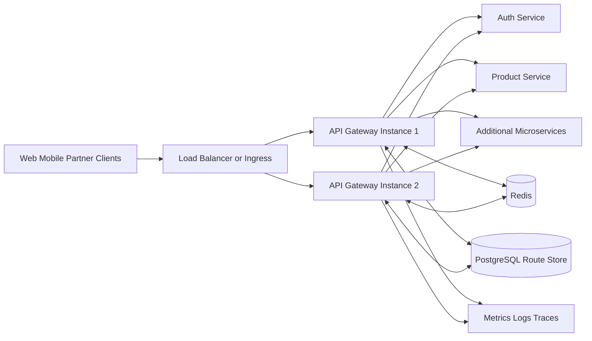

## Component responsibilities

### Client

The client knows only the public gateway address. It does not need to know internal ports, service names, or deployment topology.

### External load balancer or ingress

A production deployment normally places an L4/L7 load balancer or Kubernetes Ingress before the gateway. It distributes requests across healthy gateway instances and may terminate TLS.

### API Gateway

The gateway is responsible for cross-cutting concerns:

1. Generate or propagate the correlation ID.
2. Determine whether the path is public or protected.
3. Validate the JWT for protected paths.
4. Resolve the client rate-limit key.
5. consume a token from Redis.
6. Match the request to a static or dynamic route.
7. Apply route filters such as circuit breaker and retry.
8. Forward the request downstream.
9. record status and latency.
10. return the response with the correlation ID.

The gateway should not contain domain business logic such as product pricing or order validation. Keeping it thin reduces latency and coupling.

### Auth service

The sample auth service accepts demo credentials and issues signed JWTs. In a production system, this would normally be replaced with an identity provider such as Keycloak, Auth0, Okta, Microsoft Entra ID, or an internal OAuth/OIDC platform.

### Product service

The product service represents a protected downstream microservice. It is used to demonstrate routing and authentication propagation.

### Redis

Redis stores shared rate-limit state. Because every gateway instance accesses the same Redis deployment, a client cannot bypass its limit simply by hitting another gateway instance.

### PostgreSQL

PostgreSQL stores dynamic route definitions. It provides durability, validation opportunities, and a central source of truth for runtime-configured routes.

### Observability platform

The gateway exports metrics and emits logs/traces. In production, these signals would be consumed by Prometheus, Grafana, Loki/ELK, Jaeger, Tempo, or an OpenTelemetry backend.

## HLD request path

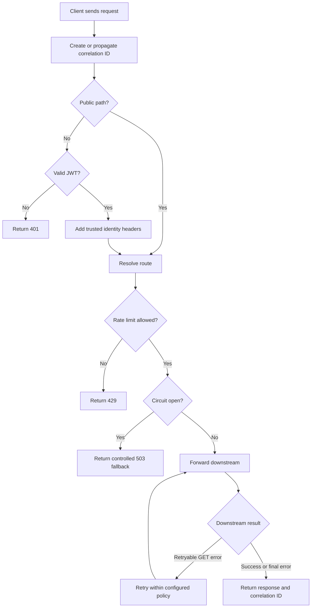

## Deployment topology

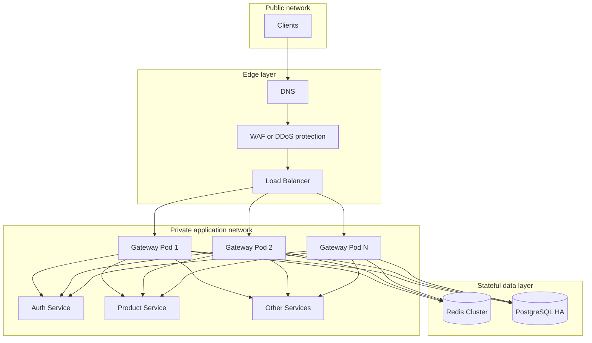

The included Docker Compose file runs one gateway instance for local development. The design remains horizontally scalable because the gateway itself stores no user session state in local memory.

---

# Low-Level Design (LLD)

## What LLD means

Low-Level Design explains how the application is implemented internally. It focuses on:

- Classes and interfaces
- Method responsibilities
- Filter ordering
- Data models
- Validation rules
- Control flow
- Error responses
- Persistence interactions
- Runtime behavior

LLD answers questions such as:

- Which class validates a token?
- Which filter runs first?
- How is a route converted from a database row into a Spring route?
- How is a correlation ID added?
- How does route refresh work?
- What response is returned on authentication failure?

## Core class diagram

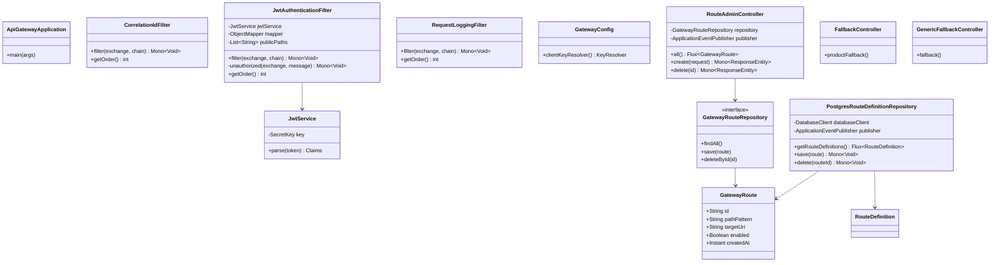

## Global filter execution order

Filter order matters because authentication, logging, and correlation behavior must happen in a predictable sequence.

| Filter | Order | Purpose |
|---|---:|---|
| `CorrelationIdFilter` | `-200` | Runs early, creates or propagates `X-Correlation-Id` |
| `JwtAuthenticationFilter` | `-100` | Validates protected requests and propagates identity |
| `RequestLoggingFilter` | `-50` | Logs request metadata and final status/duration |
| Route-specific filters | Gateway-managed | Rate limiting, circuit breaker, and retry |

A lower order value executes earlier in the request chain.

## Filter-chain sequence

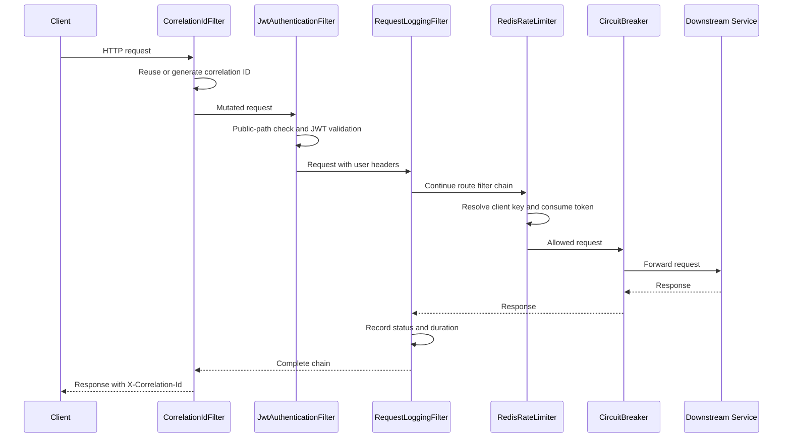

## JWT validation logic

The `JwtAuthenticationFilter` performs the following steps:

1. Read the incoming path.
2. Compare it with configured public path prefixes.
3. Allow public paths without a token.
4. Read the `Authorization` header for protected paths.
5. Require the `Bearer <token>` format.
6. Verify the token signature and expiration through `JwtService`.
7. Extract the subject and roles claims.
8. Add `X-Authenticated-User` and `X-User-Roles` headers.
9. Continue the reactive filter chain.
10. Return a JSON `401 Unauthorized` response on validation failure.

### Authentication state flow

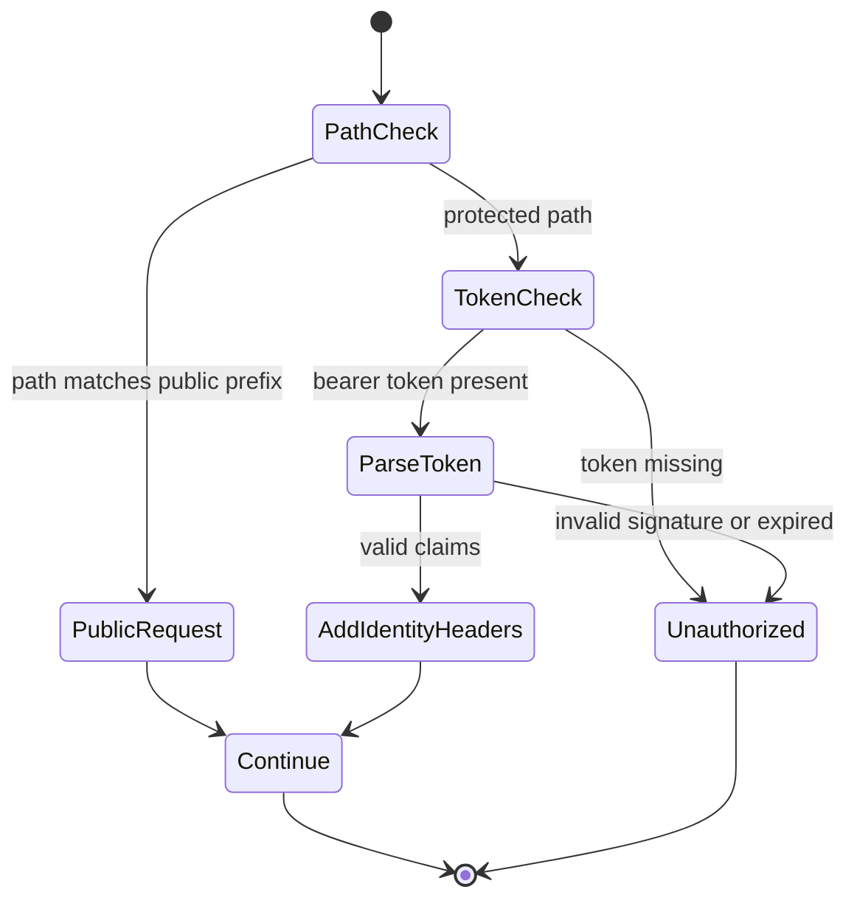

## Dynamic route lifecycle

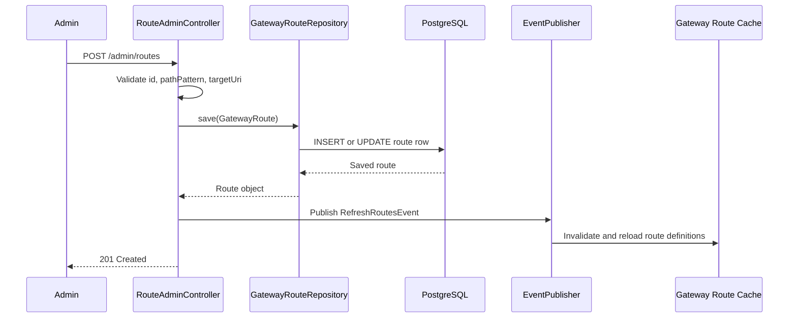

### Database route conversion

`PostgresRouteDefinitionRepository` reads enabled rows and converts each row into a Spring Cloud Gateway `RouteDefinition`:

- `id` becomes the route ID.
- `target_uri` becomes the downstream URI.
- `path_pattern` becomes a `Path` predicate.
- A route-specific circuit breaker is attached.
- The fallback URI points to `/fallback/generic`.

This repository implements Spring Cloud Gateway's `RouteDefinitionRepository`, allowing database routes and YAML routes to coexist.

## Route precedence and collision considerations

Static and dynamic routes can overlap. In a larger system, routes should include an explicit priority/order field. Without route governance, two patterns may match the same request.

Recommended production validations:

- Reject duplicate route IDs.
- Detect overlapping path patterns.
- Validate URI schemes against an allowlist.
- Prevent routes to loopback, metadata endpoints, or untrusted hosts.
- Require administrative authorization.
- Track route version and audit history.
- Support staged activation and rollback.

---

# End-to-end request flow

## Login flow

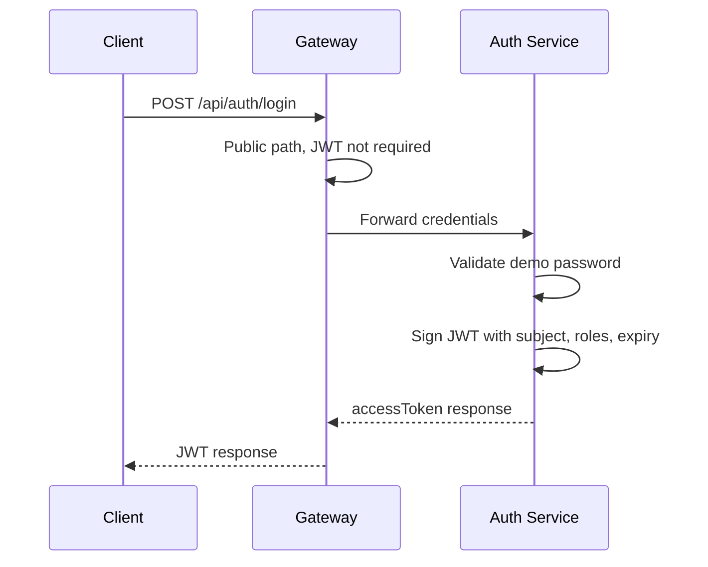

## Protected product flow

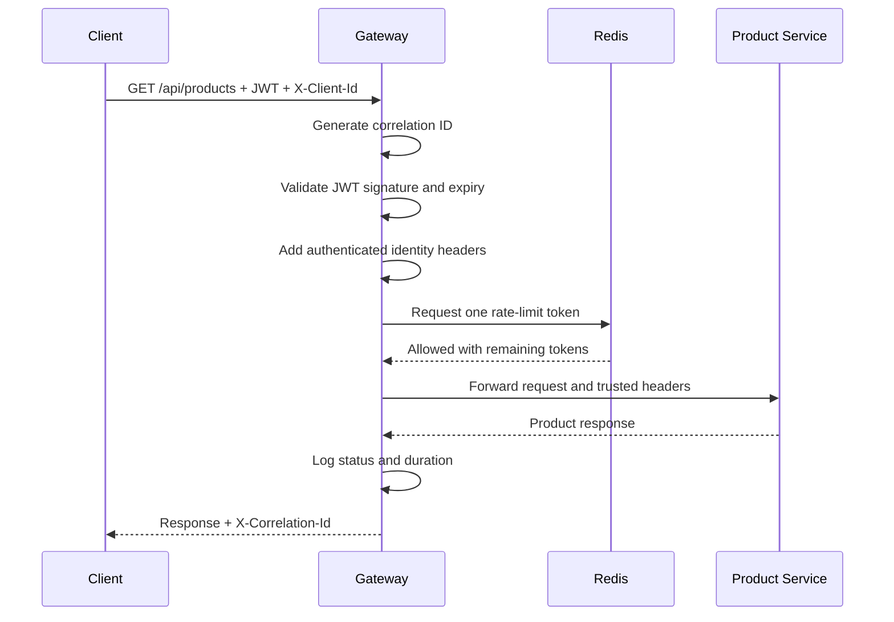

## Rate-limited flow

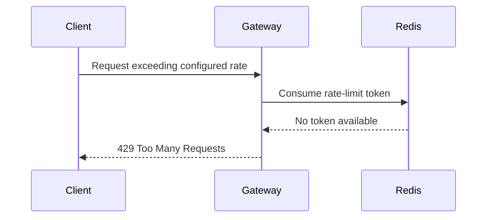

## Downstream failure flow

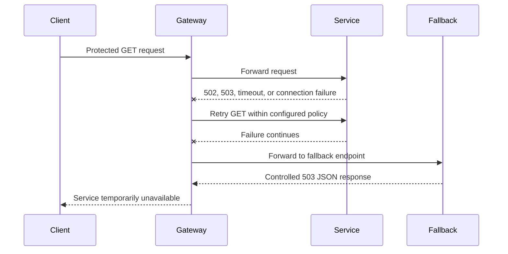

---

# Core component design

## 1. Correlation ID filter

`CorrelationIdFilter` checks for `X-Correlation-Id` on the incoming request.

- If present, the existing value is propagated.
- If absent, a UUID is generated.
- The ID is sent downstream.
- The same ID is returned in the response.

This enables support teams and engineers to trace one logical request across gateway and service logs.

Production hardening should limit correlation-ID length and allowed characters to prevent log injection or oversized headers.

## 2. JWT authentication filter

The gateway validates JWTs before requests reach protected services. This reduces unnecessary downstream traffic and centralizes basic authentication enforcement.

The gateway forwards identity using:

- `X-Authenticated-User`
- `X-User-Roles`
- `X-Correlation-Id`

Downstream services must not trust these headers from arbitrary public traffic. The network should ensure that only the gateway can reach internal services, or identity should be cryptographically propagated through a token-exchange mechanism.

## 3. Key resolver

`GatewayConfig.clientKeyResolver()` chooses the rate-limit identity:

1. Use `X-Client-Id` when supplied.
2. Otherwise use the remote IP address.
3. Fall back to `anonymous` if no address is available.

For production use, the gateway should trust forwarded IP headers only from known proxies. A client-supplied `X-Client-Id` should normally be derived from authenticated claims or an API key rather than accepted without verification.

## 4. Request logging filter

`RequestLoggingFilter` records:

- HTTP method
- Request path
- Correlation ID
- Final response status
- Total gateway duration in milliseconds

Sensitive data such as passwords, JWTs, cookies, and payment information should never be logged.

## 5. Route administration controller

`RouteAdminController` exposes endpoints to:

- List stored routes
- Create or update a route
- Delete a route

After a mutation, it publishes `RefreshRoutesEvent` so Spring Cloud Gateway reloads its route definitions.

The current demo protects these endpoints with the same JWT requirement as other protected paths but does not enforce an ADMIN role. Fine-grained authorization is listed as a production improvement.

## 6. Fallback controllers

Fallback controllers return a stable JSON response when a circuit breaker cannot call a downstream service.

A fallback should:

- Return a meaningful status such as `503 Service Unavailable`.
- Avoid exposing internal exception details.
- Include a timestamp and correlation ID where useful.
- Avoid pretending the operation succeeded.
- Provide cached/stale data only when business rules permit it.

---

# Database and Redis design

## PostgreSQL route model

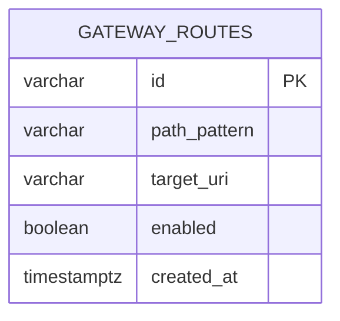

| Column | Purpose |
|---|---|
| `id` | Stable unique route identifier |
| `path_pattern` | Incoming path pattern, for example `/api/inventory/**` |
| `target_uri` | Downstream service URI |
| `enabled` | Controls whether the route is loaded |
| `created_at` | Route creation timestamp |

### Why PostgreSQL?

- Durable route configuration
- Transactional updates
- Operationally familiar storage
- Easy querying and auditing
- Suitable for route metadata, which changes far less frequently than request traffic

Route lookup is not performed from PostgreSQL for every request. Spring Cloud Gateway loads route definitions into its runtime route structures, keeping the hot request path fast.

## Redis rate-limit state

Spring Cloud Gateway uses Redis to maintain token-bucket state. Conceptually, each client key has:

- Available token count
- Last refill timestamp
- Replenishment rate
- Burst capacity

Redis-side atomic execution prevents two gateway instances from independently granting the same token.

Conceptual keys may look like:

```text
request_rate_limiter.{demo-client}.tokens
request_rate_limiter.{demo-client}.timestamp
```

The exact internal key format depends on the Spring Cloud Gateway implementation.

### Why Redis?

- Low-latency in-memory operations
- Atomic scripts
- Shared state across gateway instances
- Expiring keys
- Mature clustering and replication options

---

# Security model

## Trust boundaries

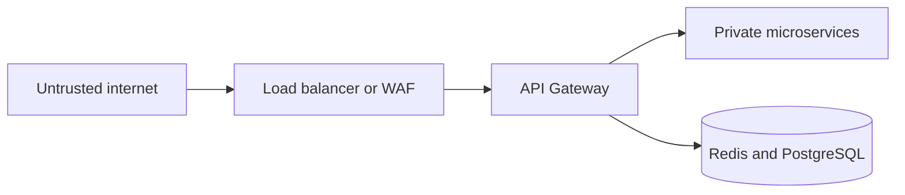

- Requests from the internet are untrusted.
- The gateway validates identity and applies policy.
- Internal services should be reachable only from trusted network paths.
- Redis and PostgreSQL should never be publicly exposed in production.

## JWT design

The demo uses a symmetric HMAC key shared by the auth service and gateway.

Production alternatives:

- Asymmetric signing with private/public keys
- JWKS endpoint and automatic key rotation
- OAuth 2.0 authorization server
- OpenID Connect discovery
- Short-lived access tokens and refresh tokens
- Token audience and issuer validation
- Revocation strategy where required

## Threats and mitigations

| Threat | Mitigation |
|---|---|
| Token tampering | Verify cryptographic signature |
| Expired token reuse | Validate expiration claim |
| Brute-force traffic | Redis rate limiting and edge WAF |
| Header spoofing | Strip external identity headers and recreate them after authentication |
| SSRF through dynamic routes | Allowlist URI schemes and service destinations |
| Route administration abuse | Require ADMIN role, audit log, and approval workflow |
| Secret exposure | Environment variables for local use; Vault/KMS in production |
| Replay of sensitive operations | Idempotency keys and service-level authorization |
| Log leakage | Redact authorization, cookies, credentials, and PII |
| Dependency compromise | Pin and scan dependencies and container images |

---

# Distributed rate limiting

## Why rate limiting belongs at the gateway

Rate limiting protects downstream services from:

- Traffic spikes
- Misbehaving clients
- Accidental loops
- Credential stuffing
- Brute-force attacks
- Noisy tenants
- Expensive endpoint abuse

## Token bucket algorithm

The configured example uses a token-bucket style limiter:

- `replenishRate = 10`: add up to 10 tokens each second.
- `burstCapacity = 20`: allow a temporary burst up to 20 tokens.
- `requestedTokens = 1`: each request consumes one token.

### Example

A client starts with up to 20 tokens. It sends 20 requests immediately, which may be accepted. Additional requests are rejected until tokens refill at 10 per second.

## Distributed behavior

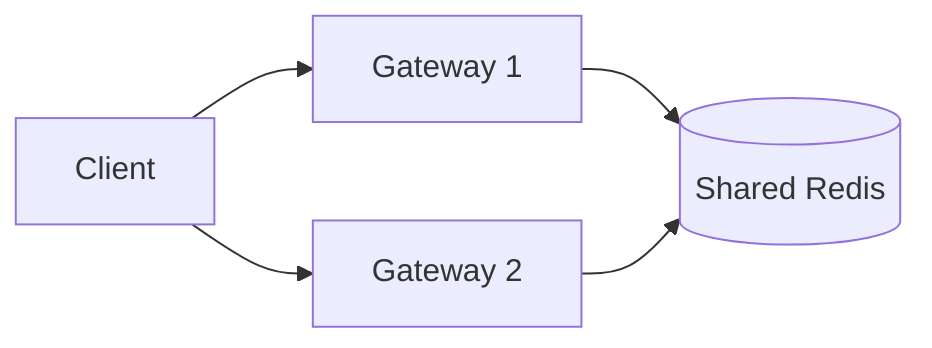

Because both gateways share Redis, the rate limit applies globally to the client rather than separately per gateway instance.

## Choosing the rate-limit key

Possible keys include:

- Authenticated user ID
- API key
- Tenant ID
- Subscription plan
- IP address
- Endpoint plus user combination

For a multi-tenant SaaS system, a strong design is often:

```text
tenantId:userId:routeId
```

This supports per-tenant and per-endpoint policy while avoiding one global limit for unrelated operations.

## Rate-limiter failure strategy

Two policies are possible when Redis fails:

- **Fail closed:** reject requests because limits cannot be enforced. Safer for payment, authentication, or abuse-sensitive endpoints.
- **Fail open:** allow requests temporarily. Better availability, but downstream systems may be exposed to overload.

The correct choice depends on endpoint criticality and risk. Production systems may configure different behavior per route.

---

# Static and dynamic routing

## Static routes

Static routes are defined in `application.yml`. They are appropriate for:

- Core services
- Stable routes
- Configuration managed through deployment pipelines
- Routes requiring complex filter configuration

Current static routes:

- `/api/auth/**` → auth service
- `/api/products/**` → product service

## Dynamic routes

Dynamic routes are stored in PostgreSQL and loaded at runtime. They are useful when:

- Routes must change without restarting the gateway
- An operations team manages service onboarding
- Multiple environments use different downstream targets
- Route activation must be controlled centrally

## Route matching concept

A route contains:

1. **ID** – unique identifier.
2. **Predicate** – condition that decides whether the route matches.
3. **URI** – downstream destination.
4. **Filters** – behavior applied before/after forwarding.

Example conceptual route:

```yaml
id: product-route
predicate: Path=/api/products/**
uri: http://product-service:8082
filters:
  - RequestRateLimiter
  - CircuitBreaker
  - Retry
```

## Dynamic route refresh

Creating or deleting a route publishes `RefreshRoutesEvent`. The gateway clears/rebuilds its route definitions, allowing traffic to use the new configuration without a process restart.

For a multi-instance deployment, an in-process refresh event affects only the instance handling the change. A production design should broadcast route-change events through Redis Pub/Sub, Kafka, a configuration service, or Kubernetes rollout mechanisms so every instance refreshes consistently.

---

# Resilience and failure handling

## Circuit breaker

A circuit breaker prevents repeated calls to an unhealthy service.

### States

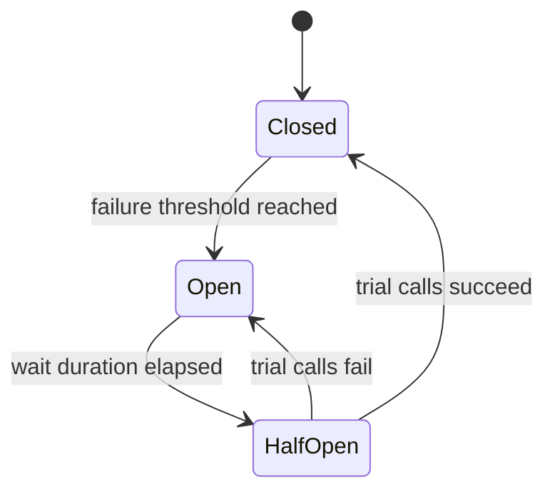

- **Closed:** calls flow normally and failures are measured.
- **Open:** calls are rejected quickly and sent to fallback.
- **Half-open:** a limited number of trial calls check whether the service recovered.

### Why it matters

Without a circuit breaker, every request waits for a failing dependency, consuming connections, memory, and time. This can cause cascading failure.

## Retry

The product route retries selected GET requests for `502` or `503` responses.

Retries should be used carefully:

- Retry only transient failures.
- Prefer idempotent operations.
- Use exponential backoff and jitter in production.
- Bound the number of attempts.
- Include the retry load in capacity planning.
- Do not retry validation or authentication failures.

A POST that creates a payment or order should not be blindly retried unless the downstream service supports an idempotency key.

## Timeout

Every downstream call should have connection and response timeouts. A request without a timeout can occupy resources indefinitely.

Recommended production configuration includes:

- Connection timeout
- Response timeout
- Per-route overrides
- Time budget smaller than the client timeout

## Bulkhead

A bulkhead isolates resources so one failing service cannot consume all gateway capacity. In reactive systems, connection-pool and concurrency limits can serve as bulkheads.

## Fallback

Fallbacks should be truthful. For the sample system, a `503` response is returned rather than fabricated product data.

---

# Observability

## Three pillars

### Metrics

Metrics answer aggregate questions:

- What is the request rate?
- What is p50/p95/p99 latency?
- Which routes return the most 5xx responses?
- How often is the circuit breaker open?
- How many requests are rate limited?

### Logs

Logs provide event-level detail. The gateway logs method, path, status, duration, and correlation ID.

### Traces

Distributed traces show the time spent across gateway and downstream services. They are especially useful for identifying whether latency originates in the gateway, network, database, or business service.

## Important gateway metrics

| Metric | Why it matters |
|---|---|
| Requests per second by route | Capacity and traffic distribution |
| p50/p95/p99 latency | User experience and tail latency |
| 4xx rate | Client errors, auth failures, or bad requests |
| 5xx rate | Gateway or downstream instability |
| 429 rate | Rate-limit pressure or abuse |
| Active connections | Gateway saturation |
| Circuit-breaker state | Dependency health |
| Retry count | Hidden amplification and dependency issues |
| Redis latency/errors | Rate-limiter health |
| PostgreSQL route-load errors | Dynamic configuration health |

## Correlation versus trace IDs

- A **correlation ID** is an application-level identifier propagated through logs and responses.
- A **trace ID** is generated by tracing instrumentation and connects spans across services.

They can coexist. Support teams may search by correlation ID while observability tools use trace IDs for detailed timing.

## Available endpoints

```text
GET /actuator/health
GET /actuator/prometheus
GET /actuator/gateway/routes
```

Do not expose detailed Actuator endpoints publicly in production. Protect them through network policy and authentication.

---

# Scalability and high availability

## Horizontal gateway scaling

The gateway is stateless with respect to user sessions, so additional instances can be added behind a load balancer.

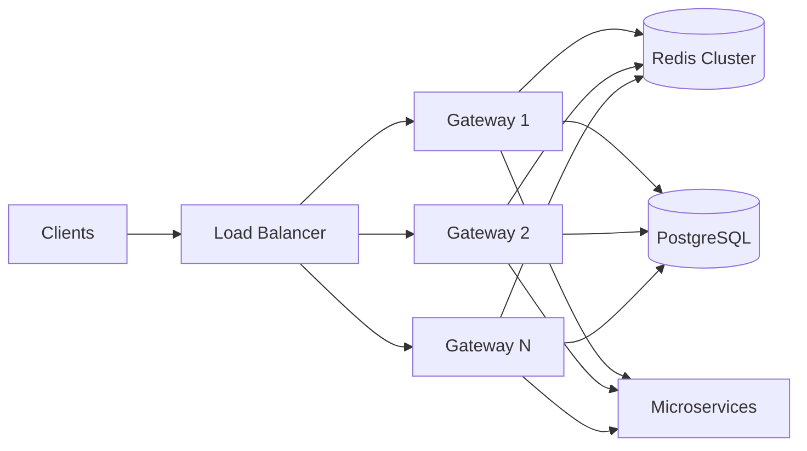

## Scaling considerations

### Gateway

- Add instances based on CPU, event-loop utilization, latency, and active connections.
- Avoid blocking database or network calls on the reactive event loop.
- Size connection pools and file-descriptor limits.
- Apply graceful shutdown so in-flight requests can complete.

### Redis

- Use replication and Sentinel or Redis Cluster.
- Monitor memory, command latency, evictions, and failovers.
- Choose a failure strategy for rate limiting.

### PostgreSQL

- Route configuration is low-write and low-volume compared with request traffic.
- Use primary/standby high availability.
- Cache route definitions in gateway memory.
- Avoid hitting PostgreSQL on every request.

### Downstream services

- Scale independently based on route-specific traffic.
- Use service discovery or platform-native DNS.
- Define per-route timeouts, limits, and circuit breakers.

## Capacity-estimation example

Suppose the platform receives 10,000 requests per second at peak and one gateway instance safely handles 2,000 requests per second at the target p99 latency.

A basic capacity estimate is:

```text
Required instances = peak RPS / safe RPS per instance
                   = 10,000 / 2,000
                   = 5 instances
```

With 40% headroom and tolerance for one instance failure:

```text
5 × 1.4 = 7 instances after rounding
```

Real capacity must be measured through load testing rather than claimed from theory.

---

# Consistency and design trade-offs

## Route consistency

PostgreSQL is the route source of truth, but route definitions are loaded into each gateway instance. During a route update, instances may temporarily observe different versions.

Options:

- Accept eventual consistency for non-critical route changes.
- Broadcast refresh events to all instances.
- Version route configurations.
- Use an atomic active-version pointer.
- Apply blue/green route configuration releases.

## Availability versus strict rate limiting

A shared Redis limiter improves consistency but adds a dependency to the request path.

- Local in-memory limiting is highly available but inconsistent across instances.
- Redis limiting is globally consistent but can fail when Redis is unavailable.

## Gateway authentication versus service authentication

Validating at the gateway saves downstream work. However, relying only on the gateway creates a trust assumption.

A zero-trust design may validate the JWT again at each service or exchange the external token for a short-lived internal token.

## Dynamic routing versus deployment-managed routing

Dynamic routing enables fast operational changes but increases security and governance risk. Deployment-managed configuration is slower but easier to review and reproduce.

A mature platform often supports both:

- Static configuration for core routes
- Controlled dynamic configuration for approved operational use cases

## Reactive versus blocking architecture

Reactive processing is valuable for high-concurrency I/O-heavy gateway traffic. It adds complexity and requires every request-path dependency to remain non-blocking.

Using blocking JDBC or filesystem calls on the Netty event loop can remove the performance benefits. This project uses R2DBC for gateway database access.

---

# Running the project

## Prerequisites

- Docker Desktop
- Docker Compose
- Optional: Java 17 and Maven 3.9+ for local development

## Start all services

```bash
docker compose up --build
```

## Run in the background

```bash
docker compose up --build -d
```

## View logs

```bash
docker compose logs -f api-gateway
```

## Stop services

```bash
docker compose down
```

## Remove containers and local volumes

```bash
docker compose down -v
```

## Service endpoints

| Service | Address |
|---|---|
| API Gateway | `http://localhost:8080` |
| Auth service | `http://localhost:8081` |
| Product service | `http://localhost:8082` |
| PostgreSQL | `localhost:5432` |
| Redis | `localhost:6379` |

## Environment variables

| Variable | Default | Purpose |
|---|---|---|
| `JWT_SECRET` | Development-only value | Shared HMAC signing key |
| `DB_HOST` | `localhost` | PostgreSQL host used by gateway |
| `REDIS_HOST` | `localhost` | Redis host used by gateway |
| `AUTH_SERVICE_URL` | `http://localhost:8081` | Auth route destination |
| `PRODUCT_SERVICE_URL` | `http://localhost:8082` | Product route destination |

Never use the default JWT secret in a deployed environment.

---

# API examples

## 1. Check gateway health

```bash
curl http://localhost:8080/actuator/health
```

## 2. Obtain a JWT

For demonstration, the auth service accepts any non-empty username with password `password`.

```bash
curl -X POST http://localhost:8080/api/auth/login \
  -H "Content-Type: application/json" \
  -d '{
    "username": "shailendra",
    "password": "password"
  }'
```

Example response:

```json
{
  "accessToken": "eyJ...",
  "tokenType": "Bearer",
  "expiresIn": 3600
}
```

Store the token:

```bash
TOKEN="PASTE_ACCESS_TOKEN_HERE"
```

## 3. Call the protected product route

```bash
curl http://localhost:8080/api/products \
  -H "Authorization: Bearer $TOKEN" \
  -H "X-Client-Id: demo-client"
```

The response includes an `X-Correlation-Id` header.

## 4. Verify unauthorized behavior

```bash
curl -i http://localhost:8080/api/products
```

Expected result: `401 Unauthorized`.

## 5. Create a dynamic route

```bash
curl -X POST http://localhost:8080/admin/routes \
  -H "Authorization: Bearer $TOKEN" \
  -H "Content-Type: application/json" \
  -d '{
    "id": "inventory-route",
    "pathPattern": "/api/inventory/**",
    "targetUri": "http://inventory-service:8083",
    "enabled": true
  }'
```

The destination service must exist and be reachable from the gateway network before the route can return successful responses.

## 6. List dynamic routes

```bash
curl http://localhost:8080/admin/routes \
  -H "Authorization: Bearer $TOKEN"
```

## 7. Delete a dynamic route

```bash
curl -X DELETE http://localhost:8080/admin/routes/inventory-route \
  -H "Authorization: Bearer $TOKEN"
```

## 8. Inspect active gateway routes

```bash
curl http://localhost:8080/actuator/gateway/routes \
  -H "Authorization: Bearer $TOKEN"
```

## 9. View Prometheus metrics

```bash
curl http://localhost:8080/actuator/prometheus \
  -H "Authorization: Bearer $TOKEN"
```

---

# Testing strategy

## Unit tests

Recommended unit-test targets:

- JWT signature validation
- Expired token rejection
- Public-path bypass
- Missing authorization header
- Correlation-ID generation and propagation
- Client-key resolution
- Route request validation
- Fallback response structure

## Integration tests

Use Spring Boot Test, WebTestClient, Testcontainers PostgreSQL, and Testcontainers Redis to verify:

- Login through the gateway
- Protected route access with a valid token
- 401 behavior without a token
- 429 behavior after rate-limit exhaustion
- Dynamic route creation and refresh
- Circuit-breaker fallback when the product service is stopped
- PostgreSQL and Redis connectivity

## Load tests

Tools such as Gatling, k6, or JMeter can measure:

- Maximum stable requests per second
- p50, p95, and p99 latency
- Error rate under load
- Gateway CPU and memory usage
- Redis latency
- Behavior during downstream slowdown
- Recovery after a circuit breaker opens

Do not put throughput or latency numbers on a resume until they are measured in a reproducible test environment.

## Failure-injection tests

1. Stop the product service and verify the fallback.
2. Add latency to the product service and verify timeouts/circuit behavior.
3. Stop Redis and observe the configured rate-limiter failure mode.
4. Restart PostgreSQL and verify gateway startup/recovery behavior.
5. Send malformed and expired JWTs.
6. Create overlapping dynamic routes and verify governance controls once implemented.

---

# Production readiness roadmap

## Security

- Replace demo authentication with OAuth 2.0/OIDC.
- Use asymmetric JWT signing and JWKS rotation.
- Validate issuer, audience, and token type.
- Strip externally supplied identity headers before adding trusted values.
- Enforce ADMIN role for route-management APIs.
- Validate and allowlist dynamic target URIs.
- Store secrets in Vault or cloud secret manager.
- Add TLS externally and mTLS internally.

## Routing and configuration

- Add route priority and metadata.
- Support filter configuration in the database.
- Validate overlapping route patterns.
- Add optimistic locking and route versions.
- Add audit history and rollback.
- Broadcast route refresh events to all instances.
- Add service discovery integration.

## Resilience

- Configure explicit connect and response timeouts.
- Add exponential backoff and jitter.
- Add bulkhead limits.
- Tune circuit breakers per route.
- Add graceful degradation rules.
- Define fail-open/fail-closed rate-limit behavior.

## Observability

- Export traces using OpenTelemetry.
- Add Prometheus and Grafana dashboards.
- Centralize logs using Loki or ELK.
- Add route-level SLOs and alerts.
- Add RED metrics: Rate, Errors, Duration.
- Add dependency health dashboards.

## Platform and deployment

- Add Kubernetes manifests or Helm charts.
- Add readiness and liveness probes.
- Add horizontal pod autoscaling.
- Add rolling or canary deployments.
- Add CI/CD with tests, image scanning, and signed images.
- Run Redis and PostgreSQL in highly available managed configurations.

---

# Interview discussion guide

## How to explain the project in 60 seconds

> I built a reactive API Gateway using Java 17, Spring Boot, and Spring Cloud Gateway. It acts as a single entry point for microservices and centralizes JWT authentication, Redis-based distributed rate limiting, static and PostgreSQL-backed dynamic routing, circuit breakers, retries, correlation IDs, logging, and Prometheus metrics. The gateway is stateless, so it can scale horizontally behind a load balancer, while Redis provides shared throttling state and PostgreSQL stores durable route configuration. I also included an auth service and product service to demonstrate the complete request flow through Docker Compose.

## Common interview questions

### Why use an API Gateway?

It hides internal service topology, reduces duplicated cross-cutting logic, provides centralized policy enforcement, and gives clients a stable endpoint.

### Why Spring Cloud Gateway instead of a servlet gateway?

It uses WebFlux and non-blocking I/O, which is well suited for high-concurrency network proxy workloads. The trade-off is greater reactive-programming complexity.

### Why Redis for rate limiting?

Redis provides low-latency shared state and atomic scripts, so multiple gateway instances enforce one consistent limit.

### Why should the gateway remain stateless?

Stateless instances can be scaled, replaced, and load-balanced without sticky sessions. Shared state belongs in external systems such as Redis or PostgreSQL.

### Why not store routes only in YAML?

YAML is simple and version-controlled but requires redeployment for changes. Database-backed routes allow runtime onboarding and updates. The trade-off is added governance, security, and consistency complexity.

### What happens if Redis fails?

The system must choose fail-open or fail-closed behavior based on endpoint risk. Critical endpoints may fail closed; availability-sensitive endpoints may temporarily fail open with downstream protection.

### Why restrict retries to GET?

GET is normally idempotent. Blindly retrying state-changing requests can create duplicate orders, payments, or side effects.

### How would you secure dynamic route creation?

Require an administrator role, validate target URIs against an allowlist, record an immutable audit trail, use approval workflows, detect overlapping paths, and support rollback.

### How would you scale to multiple regions?

Use regional gateways and data stores, route users through geo-aware DNS, replicate route configuration, keep rate-limit policy region-aware, and define whether limits are regional or global.

### What is the biggest bottleneck?

Potential bottlenecks include gateway event-loop saturation, downstream latency, Redis latency, connection pools, TLS overhead, and logging volume. Load tests and metrics determine the actual bottleneck.

### Gateway authentication or service authentication?

Gateway authentication reduces duplicate work, but services should still enforce authorization and should not blindly trust headers from public networks. Zero-trust environments may validate tokens again or use internal token exchange.

---

# Resume-ready description

**Distributed API Gateway**  
- Developed a scalable API Gateway using Java 17, Spring Boot, Spring Cloud Gateway, Redis, PostgreSQL, and Docker.  
- Implemented dynamic routing, JWT authentication, distributed rate limiting, circuit breakers, retries, tracing, and centralized logging.

---

## Design summary

This project demonstrates that an API Gateway is not only a reverse proxy. It is a distributed policy-enforcement layer that must balance:

- Security and latency
- Availability and consistency
- Flexibility and governance
- Retries and traffic amplification
- Centralization and service autonomy
- Dynamic configuration and operational safety

The included implementation provides a strong foundation, while the production roadmap explains how the same design can evolve for larger-scale environments.
