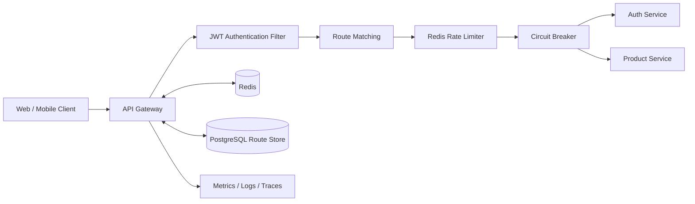
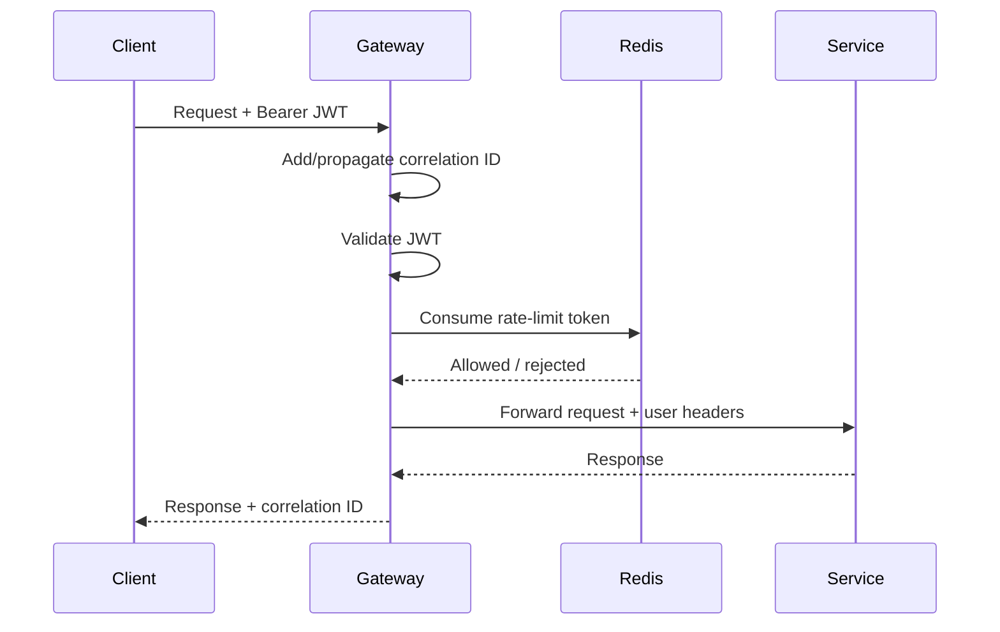
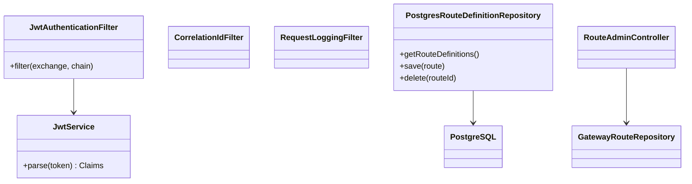
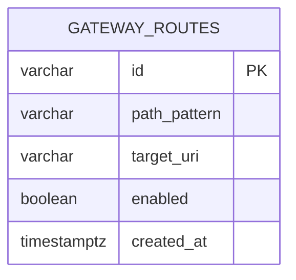
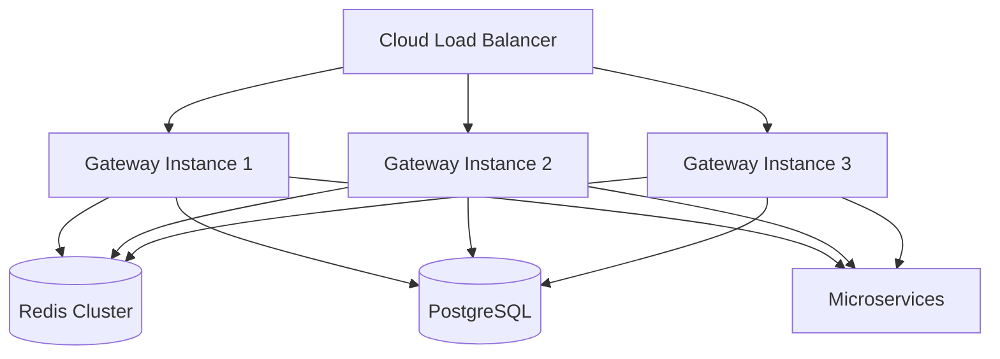

# Distributed API Gateway

A production-style API Gateway built with Java 17, Spring Boot, Spring Cloud Gateway, Redis, PostgreSQL, Resilience4j, Micrometer, and Docker.

It demonstrates centralized authentication, dynamic routing, distributed rate limiting, load-balanced downstream access, circuit breakers, retries, request tracing, correlation IDs, centralized logging, and failure isolation.

## Why this project matters

In a microservices architecture, clients should not need to understand every internal service. The gateway provides one stable entry point and centralizes cross-cutting concerns such as security, throttling, routing, observability, and resilience.

## Features

- Reactive API Gateway using Spring Cloud Gateway
- JWT authentication and downstream identity propagation
- Redis-backed distributed rate limiting
- Static and PostgreSQL-backed dynamic routes
- Runtime route refresh after create or delete
- Circuit breaker and fallback responses
- Retry policy for safe GET requests
- Correlation ID propagation
- Structured request/response logging
- Micrometer tracing and Prometheus metrics
- Health and gateway actuator endpoints
- Docker Compose environment
- Example authentication and product services
- Unit test for JWT parsing

## Technology stack

| Area | Technology |
|---|---|
| Language | Java 17 |
| Gateway | Spring Cloud Gateway, Project Reactor |
| Security | JWT, JJWT |
| Rate limiting | Redis token bucket |
| Resilience | Resilience4j circuit breaker and retry |
| Route storage | PostgreSQL with R2DBC |
| Observability | Actuator, Micrometer, Prometheus, Brave tracing |
| Packaging | Maven multi-module project |
| Runtime | Docker and Docker Compose |

## High-Level Design



## Request flow



## Low-Level Design



## Project structure

```text
distributed-api-gateway/
├── api-gateway/
│   ├── config/
│   ├── filter/
│   ├── route/
│   ├── security/
│   └── web/
├── auth-service/
├── product-service/
├── docker-compose.yml
└── pom.xml
```

## Core design decisions

### Reactive gateway

Spring Cloud Gateway runs on WebFlux and uses non-blocking I/O. This allows the gateway to handle many concurrent connections without allocating one thread per request.

### JWT validation at the edge

The gateway validates the bearer token before forwarding protected requests. It propagates authenticated identity through internal headers:

- `X-Authenticated-User`
- `X-User-Roles`
- `X-Correlation-Id`

In a production zero-trust environment, downstream services should still enforce authorization and reject identity headers from untrusted networks.

### Distributed rate limiting

The product route uses Spring Cloud Gateway's Redis rate limiter. Redis makes limits consistent across multiple gateway instances.

Current example policy:

- Replenish rate: 10 requests/second
- Burst capacity: 20 requests
- Key: `X-Client-Id`, falling back to source IP

### Dynamic routing

Routes can be stored in PostgreSQL and loaded by `PostgresRouteDefinitionRepository`. Route changes publish `RefreshRoutesEvent`, so the gateway refreshes routes without a restart.

### Resilience

The product route has:

- Circuit breaker
- Fallback response
- Two retries for GET requests returning 502 or 503

Retries are intentionally restricted to idempotent GET requests.

## Run with Docker

### Prerequisites

- Docker Desktop
- Docker Compose

### Start the platform

```bash
docker compose up --build
```

Services:

| Service | URL |
|---|---|
| Gateway | `http://localhost:8080` |
| Auth service | `http://localhost:8081` |
| Product service | `http://localhost:8082` |
| PostgreSQL | `localhost:5432` |
| Redis | `localhost:6379` |

## API usage

### 1. Obtain a JWT

For demonstration, every username is accepted with password `password`.

```bash
curl -X POST http://localhost:8080/api/auth/login \
  -H "Content-Type: application/json" \
  -d '{"username":"shailendra","password":"password"}'
```

Response:

```json
{
  "accessToken": "eyJ...",
  "tokenType": "Bearer",
  "expiresIn": 3600
}
```

### 2. Call a protected service

```bash
curl http://localhost:8080/api/products \
  -H "Authorization: Bearer YOUR_TOKEN" \
  -H "X-Client-Id: demo-client"
```

### 3. Add a dynamic route

```bash
curl -X POST http://localhost:8080/admin/routes \
  -H "Authorization: Bearer YOUR_TOKEN" \
  -H "Content-Type: application/json" \
  -d '{
    "id": "inventory-route",
    "pathPattern": "/api/inventory/**",
    "targetUri": "http://inventory-service:8083",
    "enabled": true
  }'
```

### 4. List dynamic routes

```bash
curl http://localhost:8080/admin/routes \
  -H "Authorization: Bearer YOUR_TOKEN"
```

### 5. Delete a dynamic route

```bash
curl -X DELETE http://localhost:8080/admin/routes/inventory-route \
  -H "Authorization: Bearer YOUR_TOKEN"
```

## Observability

```text
GET /actuator/health
GET /actuator/prometheus
GET /actuator/gateway/routes
```

Every response includes `X-Correlation-Id`. The same ID is forwarded downstream and written to gateway logs.

## Database model



## Scaling strategy



The gateway is stateless. Add instances horizontally behind a load balancer. Redis coordinates rate limits, while PostgreSQL provides persistent route configuration.

## Failure scenarios

| Failure | Behavior |
|---|---|
| Invalid or expired JWT | Gateway returns HTTP 401 |
| Rate limit exceeded | Gateway returns HTTP 429 |
| Product service unavailable | Circuit breaker returns HTTP 503 fallback |
| Redis unavailable | Rate limiting may fail; production policy should fail open or closed explicitly |
| PostgreSQL unavailable | Existing static routes continue; dynamic route loading is affected |
| Gateway instance fails | Load balancer routes traffic to another instance |

## Security improvements for production

- Store secrets in Vault, AWS Secrets Manager, or Kubernetes Secrets
- Use RSA/ECDSA keys and JWKS instead of a shared HMAC secret
- Add role-based authorization per route
- Use TLS/mTLS between gateway and services
- Protect actuator and route-admin endpoints
- Sanitize forwarded headers
- Add CORS policy and request-size limits
- Integrate OAuth 2.0/OpenID Connect
- Add WAF and bot protection

## Testing strategy

- Unit tests for JWT parsing and filters
- WebTestClient integration tests for authentication failures
- Testcontainers for Redis and PostgreSQL
- WireMock tests for downstream timeout and circuit-breaker behavior
- Gatling or k6 load tests for latency, throughput, and rate limiting
- Chaos tests for Redis and downstream service failures

Run tests locally:

```bash
mvn clean test
```

Build all modules:

```bash
mvn clean package
```

## Production extensions

- Eureka or Consul service discovery
- OAuth 2.0 resource server with JWKS rotation
- Per-tenant and per-route rate-limit policies
- Request/response transformation rules
- API key management
- Canary and weighted routing
- OpenTelemetry collector and Grafana dashboards
- Kubernetes manifests and Horizontal Pod Autoscaler
- Route configuration audit history
- Admin authorization and approval workflow

## Interview discussion points

1. Why use a gateway instead of exposing services directly?
2. Why is Redis appropriate for distributed throttling?
3. What happens when Redis is unavailable?
4. Which operations are safe to retry?
5. How do circuit breakers prevent cascading failures?
6. How would you rotate JWT signing keys?
7. How would you avoid the gateway becoming a bottleneck?
8. How are dynamic routes refreshed consistently across instances?
9. When should authentication happen at both gateway and service levels?
10. How would you implement canary routing?

## Resume description

**Distributed API Gateway**

- Developed a scalable API Gateway using Java 17, Spring Boot, Spring Cloud Gateway, Redis, PostgreSQL, and Docker.
- Implemented dynamic routing, JWT authentication, distributed rate limiting, circuit breakers, retries, tracing, and centralized logging.

## Disclaimer

This project is designed for learning, portfolio demonstration, and system-design discussion. The demo authentication service uses simplified credentials and must not be used as-is in production.
